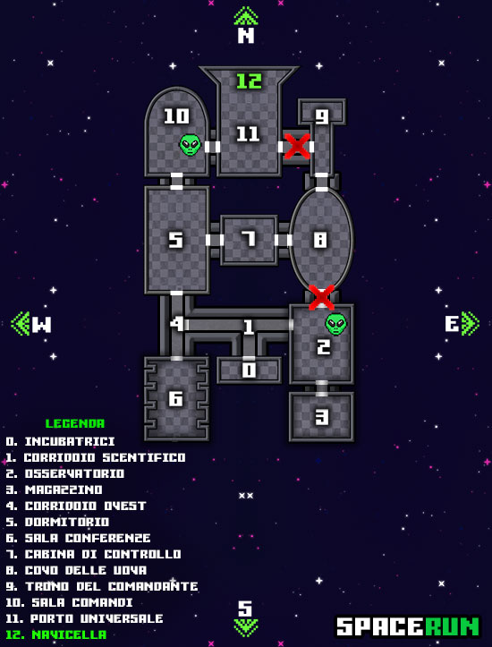

# SpaceRun

## Descrizione:
SpaceRun è un avventura testuale con ambientazione horror fantascientifica, il cui obiettivo è la fuga verso la salvezza. Accompagnato da un interfaccia grafica simil terminale tecnlogico anni '80, l'utente dovrà muoversi tra le stanze di una navicella aliena in cerca di indizi ed oggetti, mai banali, per sbloccare eventi e nuove parti inizialmente inaccessibili della mappa con la speranza di rimanere vivo.

Attraverso la struttura della navicella, l'utente è stato volutamente spinto a farsi assalire da un senso di curiosità in modo che tutte le stanze alla fine del gioco risultassero ben osservate, dando anche la possibilità però, di effettuare una speed-run per gli user che più si immergono nella corsa per la salvezza, non badando ad extra.

Il linguaggio è più descrittivo possibile in modo da sostituire la parte visiva non presente, con la creazione di mondi nella propria immaginazione. I vari messaggi per ogni azione compiuta sono a tratti ironici in un certo senso, per far si di non cadere mai nel noioso/frustante ed infine non c'è la presenza di musica e o immagini ad eccezione della mappa reale del gioco disegnata ad-hoc, sbloccabile in una delle sezioni intermedie della storia.

Il gameplay con l'aiuto dell'interfaccia grafica risulta essere molto semplice ed intuitivo. Tramite appositi bottoni ben predisposti sullo schermo, l’utente può effettuare quasi tutte le azioni principali, che sono: le direzioni, indicate tramite i tasti dei punti cardinali (Nord, Sud, Ovest, Est), il tasto osserva per avere maggiori descrizioni legate alle stanze, il tasto invio per eseguire altre azioni scritte nell'apposita sezione, ed i tasti di salvataggio e caricamento partita.

Oltre i tasti e le sezioni precedentemente descritte, l'interfaccia presenta un largo Display per la visualizzazione dello svolgimento del gioco con accanto un piccolo schermo che conterrà gli oggetti raccolti e riposti nell'inventario, una sezione costantemente aggiornata con l'orario per risolvere qualche grattacapo e la presenza di qualche pop-up attivabile giocando e/o eseguendo operazioni di impostazione.

Non è utilizzabile un menù di help con la lista di tutti i comandi visto che la stragande maggioranza di essi è esplicitata graficamente, lasciando grandi sorprese e soddisfazioni all'utente quando scoprirà funzioni nascoste. Proprio per sopperire questa mancanza, c'è la possibilità di incontrare un piccolo esserino verde inizialmente non comprensibile, che avrà la funzione di guida sulla navicella.

Il resto è tutto presente nel gioco, cosa aspettate??

## Tecniche utilizzate: 
- Programmazione ad oggetti
- Stringhe e Regex: per output ben formattati e controlli sull'input.
- File: utilizzati per l’inizializzazione delle stanze, degli oggetti e dei rispettivi parametri; Utili per implementare facilmente altre avventure tesuali e per facilitare la futura manutenzione di esse.
- Thread: utilizzato constantemente dall'avvio alla fine dell'esecuzione, per mantenere costantemente aggiornato l'orario attuale, utile al giocatore per proseguire.
- Swing: per costruire l’interfaccia grafica dell’applicazione precedentemente e abbondantemente descritta.
- Rest: utilizzate per avere informazioni riguardo il meteo di una specifica città inseritta in input, e per avere il numero degli umani in orbita terrestre aggiornato al momento della richiesta.
- Collection: 
    - Arraylist per organizzare i dati delle stanze, degli oggetti, dell'inventario e dei comandi.
    - Iterator per le ricerche negli Arraylist.
    - Tipo enumerativo per classificare i comandi inseribili dell’utente.
    - Set per creare gli alias, semplificando il riferimento ad oggetti, stanze e comandi.
- H2 Database Engine: utilizzato per il salvataggio e il caricamento delle partite, mantenendo le informazioni riguardanti l'ultima stanza visitata e gli oggetti presenti nell'inventario. Il salvataggio e il caricamento avvengono digitando il nome della partita scelto dall'utente (case sensitive).

## Diagramma delle classi:

## Specifica algebrica:
Una lista è una sequenza finita, anche vuota, di elementi dello stesso tipo. Indichiamo la lista con la notazione  L = < a1, a2, … , an > n ≥ 0. La lista è dunque una struttura dati dinamica.

**Specifica sintattica:**

● Tipi: lista, posizione, boolean, tipoelem

● Operatori:
- crealista : ( ) → lista
- listavuota: (lista) → boolean
- leggilista : (posizione, lista) → tipoelem
- scrivilista: (tipoelem,posizione,lista) → lista
- primolista: (lista) → posizione
- finelista : (posizione, lista) → boolean
- succlista : (posizione, lista) → posizione
- predlista : (posizione, lista) → posizione
- inslista : (tipoelem,posizione,lista) → lista
- canclista : (posizione, lista) → lista

**Specifica semantica:**

Tipi:
- Lista: insieme delle sequenze l = < a1, a2, … , an >, n>=0, di
elementi di tipo tipoelem dove l'elemento i-esimo ha valore a(i) e
posizione pos(i)
- boolean: insieme dei valori di verità

Operatori:
- crealista = l'
    - POST: l' = <> (sequenza vuota)
- listavuota(l) = b
    - POST: b = true se l = < >, b = false altrimenti
- leggilista(p, l) = a
    - PRE: p = pos(i) 1 ≤ i ≤ n
    - POST: a = a(i)
- scrivilista(a, p, l) = l'
   - PRE: p = pos(i) 1 <= i <= n
   - POST: l' = < a1, a2, … , ai-1, a, ai+1, … , an >
- primolista(l) = p
   - POST: p = pos(1)
- finelista(p, l) = b
   - PRE: p = pos(i) 1 ≤ i ≤ n+1
    - POST: b = true se p = pos(n+1)
b= false altrimenti
- succlista(p, l) = q
    - PRE: p = pos(i) 1 ≤ i ≤ n
    - POST: q = pos(i+1)
- predlista(p, l) = q
    - PRE: p = pos(i) 2 ≤ i ≤ n
    - POST: q = pos(i-1)
- inslista(a, p, l) = l'
    - PRE: p = pos(i) 1 ≤ i ≤ n+1
    - POST: l' = <a1, a2, … , ai-1, a, ai , ai+1, … , an>, se 1 ≤ i ≤ n l' = <a1, a2, … ,an, a> , se i = n+1 (e quindi l' = < a > se i = 1 e l = < >)
- canclista(p, l) = l'
    - PRE: p = pos(i) 1 ≤ i ≤ n
    - POST: l' = <a1, a2, … , ai-1, ai+1, … , an>

Costruttori:

## Informazioni aggiuntive sulle problematiche e sulle scelte sviluppative:

- L'utilizzo del gioco sui diversi sistemi operativi, potrebbe portare ad una diversa visualizzazione dell'interfaccia grafica, cambiando font e dimensione dei caratteri oltre alla corretta disposizione dei tasti e di altri oggetti grafici.

- È stata volutamente scartata una funzione di rete simil multiplayer per il gioco, in quanto la storia è interamente costruita intorno alla soggettività delle scelte e alla solitudine del personaggio. Non è esclusa una futura implementazione.

## Comandi per finire il gioco in (Speed-Run):
Attenzione così la fruizione della storia può essere compromessa. 

Seguire questi comandi eliminerebbe passaggi importanti ed Easter-Egg cosparsi per la mappa.

Inizio:
->Nord
->Est
->Sud
->Apri cassetto
->Prendi pistola
->Prendi torcia
->Nord
->Ovest
->Ovest
->Nord
->Usa torcia
->Fruga nelle divise
->Prendi tessera
->Nord
->Spara all'alieno
->Est
->Nord
->Spingi bottone rosso
->10403
-> Fine.

## Mappa del gioco:

## Autori e sviluppatori del gioco:
-	Gaetano Schiralli
-	Dafne Spaccavento
